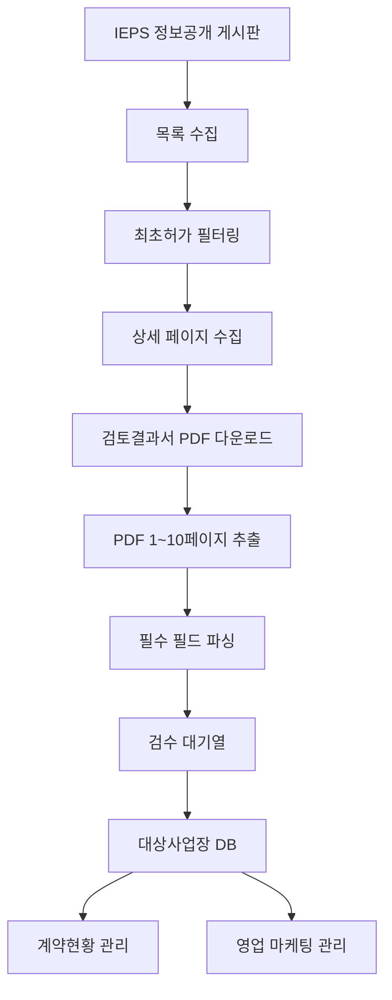

# IEPS 통합허가 대상사업장 관리앱 상세 설계서

## 1. 프로젝트 개요

본 앱은 통합환경허가시스템(IEPS)의 `정보공개 > 통합허가` 게시판에 공개되는 게시물 중 `최초허가` 게시물만 선별하여 수집하고, 첨부된 검토결과서 PDF에서 핵심 정보를 추출해 통합허가 대상사업장 리스트와 계약현황, 영업 마케팅 관리를 지원하는 내부 업무용 플랫폼이다.

IEPS의 상당수 메뉴는 로그인이 필요하지만 정보공개 게시판은 비로그인 상태에서 게시글 조회와 파일 다운로드가 가능한 것으로 전제한다. 따라서 초기 MVP는 공개 게시판과 공개 첨부 파일만 대상으로 하며, 로그인 우회나 비공개 데이터 접근 기능은 포함하지 않는다.

## 2. 핵심 목표

- IEPS 정보공개 게시판에서 최초허가 게시글 자동 수집
- 게시글 내 검토결과서 PDF 자동 다운로드
- PDF 1~10페이지 범위에서 필수 OCR/텍스트 파싱 수행
- 통합허가 대상사업장 마스터 리스트 생성
- 계약현황, 영업 단계, 마케팅 캠페인 관리
- OCR 원문 근거와 수동 검수 기능 제공

## 3. 참고 프로젝트와 재사용 방향

기존 `C:\CodingProject\Web Scraper Final` 프로젝트의 구조를 참조한다.

- `frontend\lib\scraper\scraper-engine.ts`: 목록/상세/페이지네이션 기반 수집 엔진
- `frontend\lib\scraper\attachment-downloader.ts`: 첨부파일 다운로드, 재시도, 중복 파일 처리, 타임아웃
- `frontend\scripts\cli-scraper.ts`: CLI 기반 수집 실행 구조
- `backend\app\extractors\pdf_extractor.py`: PDF 텍스트 레이어 추출, OCR, 품질 검증
- `backend\app\services\extraction_service.py`: 문서 추출 오케스트레이션

새 앱은 기존 프로젝트를 그대로 복제하기보다는 IEPS 전용 도메인 모델과 UI를 얹는 방식으로 설계한다.

## 4. 권장 기술 스택

### 4.1 프론트엔드

- Next.js
- React
- TypeScript
- Tailwind CSS 또는 CSS 변수 기반 커스텀 스타일
- Recharts 또는 SVG 기반 간단 차트

### 4.2 스크래핑

- Cheerio: 정적 HTML 목록/상세 페이지 파싱
- Playwright: JavaScript onclick 다운로드, 세션성 링크, 동적 렌더링 대응
- Node.js CLI: 수동 실행과 스케줄 실행을 동일 코드로 처리

### 4.3 문서 처리

- FastAPI
- PyMuPDF: PDF 텍스트 레이어 우선 추출
- PaddleOCR: 한국어 OCR 기본 엔진
- EasyOCR 또는 Tesseract: 보조 OCR 엔진
- pdfplumber: 표 구조 보조 추출

### 4.4 데이터 저장

- MVP: SQLite
- 다중 사용자 운영: PostgreSQL
- 파일 저장: 로컬 파일시스템 우선, 이후 S3/R2 호환 스토리지 확장

## 5. 전체 처리 흐름



## 6. 기능 설계

### 6.1 IEPS 게시판 수집

수집기는 게시판 목록 페이지를 순회하며 다음 정보를 저장한다.

- 게시글 ID
- 제목
- 게시일
- 상세 URL
- 게시글 본문 요약
- 첨부 파일 목록
- 최초허가 판정 상태
- 수집 시각

최초허가 판정은 다음 순서로 수행한다.

1. 제목에 `최초허가`, `최초 허가`, `통합허가 최초` 키워드 포함 여부 확인
2. 상세 본문에서 동일 키워드 확인
3. 첨부 파일명에서 검토결과서 및 최초허가 관련 표현 확인
4. PDF 1~10페이지 텍스트 추출 후 보조 판정

### 6.2 첨부 PDF 다운로드

검토결과서 PDF를 우선 다운로드 대상으로 한다. 첨부 파일이 여러 개인 경우 파일명과 확장자, 본문 문맥을 기준으로 검토결과서 후보를 선택한다.

다운로드 상태는 다음 값으로 관리한다.

- `pending`: 다운로드 대기
- `downloaded`: 다운로드 완료
- `failed`: 실패
- `skipped`: 중복 또는 비대상 파일로 건너뜀

권장 저장 경로는 다음과 같다.

```text
data/ieps/raw/{year}/{postId}/{attachmentId}.pdf
data/ieps/extracted/{year}/{postId}/{attachmentId}.json
data/ieps/logs/{yyyy-mm-dd}.log
```

### 6.3 PDF OCR 및 필수 필드 파싱

PDF 전체를 OCR하지 않고 기본적으로 `1~10페이지`만 처리한다. 검토결과서가 수십~수백 페이지인 경우에도 영업 리스트 생성에 필요한 정보는 앞부분에 집중되어 있으므로 처리 비용과 시간을 줄일 수 있다.

추출 우선순위는 다음과 같다.

1. PyMuPDF 텍스트 레이어 추출
2. 갑지 또는 허가결정 후보 페이지 영역 기반 OCR
3. 후보 페이지 전체 OCR
4. 필드 누락 시 검수 대기열 등록

### 6.4 필수 추출 항목

| 필드 | 위치/규칙 | 저장 방식 |
| --- | --- | --- |
| 결정번호 | `제 OOOO-O1호` 형식 | 원문과 정규화값 저장 |
| 상호 | 갑지 페이지 사업장 명칭 | 문자열 |
| 사업자등록번호 | `OOO-OO-OOOOO` 형식 | 하이픈 포함 정규화 |
| 사업장소재지 | 갑지 페이지 주소 | 원문 주소 |
| 전화번호 | 갑지 페이지 전화번호 | 원문 표기 보존 |
| 업종 | 5자리 업종코드와 업종명 | 코드/명칭 분리 |
| 허가일자 | 갑지 하단 날짜 | 날짜형 변환 |
| 종 규모 | `1.허가결정` 첫 페이지 | 대기/수질 구분 저장 |
| 생산품 | `1.허가결정` 첫 페이지 | 제품명/생산량/단위 저장 |

### 6.5 페이지 탐색 규칙

- 갑지 우선 범위: `3~5페이지`
- 전체 파싱 기본 범위: `1~10페이지`
- 갑지 확정 키워드: `배출시설등 설치운영허가 검토결과서`
- 허가결정 확정 키워드: `1.허가결정`, `허가결정`, `종 규모`, `생산품`
- 허가일자 위치: 갑지 페이지 하단 날짜
- 종 규모 위치: `1.허가결정` 항목 첫 페이지
- 생산품 위치: `1.허가결정` 항목 첫 페이지

### 6.6 OCR 보정 규칙

- 결정번호의 `O/0`, `I/1`, 공백, 하이픈 혼동을 후보값으로 관리한다.
- 사업자등록번호는 숫자 10자리 또는 `000-00-00000` 패턴만 유효값으로 인정한다.
- 업종코드는 5자리 숫자만 유효값으로 인정하고, 바로 뒤 또는 같은 행의 업종명을 연결한다.
- 단위는 원문을 보존하되 대기 발생량은 `톤/년`, 수질 폐수량은 `m3/일`로 표준 필드를 둔다.
- 추출값마다 `sourcePage`, `sourceText`, `confidence`, `needsReview`를 저장한다.

## 7. 데이터 모델 초안

### 7.1 SourcePost

- `id`
- `sourcePostId`
- `title`
- `postedAt`
- `detailUrl`
- `bodyText`
- `isFirstPermit`
- `firstPermitReason`
- `scrapedAt`

### 7.2 Attachment

- `id`
- `sourcePostId`
- `fileName`
- `downloadUrl`
- `localPath`
- `fileHash`
- `status`
- `errorMessage`

### 7.3 DocumentExtraction

- `id`
- `attachmentId`
- `pageRange`
- `coverPageNo`
- `decisionPageNo`
- `rawTextPath`
- `jsonPath`
- `status`
- `qualityScore`
- `needsReview`

### 7.4 Facility

- `id`
- `companyName`
- `businessRegistrationNo`
- `siteAddress`
- `phoneNumber`
- `industryCode`
- `industryName`
- `normalizedCompanyName`
- `normalizedAddress`

### 7.5 Permit

- `id`
- `facilityId`
- `decisionNo`
- `permitType`
- `permitDate`
- `isFirstPermit`
- `sourcePostId`
- `attachmentId`

### 7.6 PermitScale

- `id`
- `permitId`
- `airClass`
- `airPollutantAmountTonPerYear`
- `waterClass`
- `wastewaterAmountM3PerDay`
- `sourcePage`
- `sourceText`

### 7.7 ProductOutput

- `id`
- `permitId`
- `productName`
- `productionAmount`
- `productionUnit`
- `sourcePage`
- `sourceText`

### 7.8 ParsedField

- `id`
- `documentExtractionId`
- `fieldName`
- `rawValue`
- `normalizedValue`
- `sourcePage`
- `sourceText`
- `confidence`
- `needsReview`
- `reviewedValue`

### 7.9 SalesOpportunity

- `id`
- `facilityId`
- `stage`
- `owner`
- `expectedAmount`
- `probability`
- `nextActionAt`
- `memo`

### 7.10 Campaign

- `id`
- `name`
- `segmentRule`
- `startedAt`
- `endedAt`
- `status`

### 7.11 ActivityLog

- `id`
- `facilityId`
- `opportunityId`
- `activityType`
- `activityAt`
- `content`
- `createdBy`

## 8. UI/UX 설계

### 8.1 디자인 방향

미적 방향성은 `Industrial Editorial Dashboard`로 설정한다. 공공 인허가 문서, 산업시설, 검토결과서의 질감을 살리되 평범한 흰 배경 SaaS나 보라색 AI 대시보드 느낌은 배제한다.

### 8.2 색상 시스템

- `--ink`: 짙은 먹색
- `--oxide`: 산화동 녹색
- `--paper`: 서류 베이지
- `--signal`: 경고 주황
- `--cyan`: 전기 청록
- `--line`: 인쇄물 선 색상

### 8.3 레이아웃 원칙

- 비대칭 12컬럼 그리드
- 좌측: 수집 파이프라인 상태
- 중앙: 대상사업장 리스트와 OCR 근거
- 우측: 계약 파이프라인과 다음 액션
- 카드 hover 시 PDF 원문 근거 문장을 드러내는 `Evidence Strip`
- 페이지 진입 시 KPI, 파이프라인, 리스트 순서로 staggered reveal

## 9. 주요 화면

### 9.1 대시보드

- 신규 최초허가 게시물 수
- 다운로드 완료 PDF 수
- OCR 완료/검수 필요 수
- 신규 대상사업장 수
- 계약 단계별 파이프라인
- 우선 연락 대상 사업장

### 9.2 수집 모니터

- 수동 수집 실행
- 마지막 수집 시각
- 페이지별 수집 상태
- 게시글별 진행 상태
- 실패 로그 및 재시도

### 9.3 사업장 리스트

- 필터: 지역, 업종, 허가일자, 종 규모, 영업 단계, OCR 신뢰도
- 컬럼: 상호, 사업자등록번호, 소재지, 업종, 결정번호, 허가일자, 종 규모, 생산품, 계약 단계
- 행 클릭 시 상세 패널 오픈

### 9.4 사업장 상세

- 갑지 추출 정보
- `1.허가결정` 추출 정보
- PDF 원문 텍스트 뷰어
- 필드별 수동 보정
- 계약현황과 활동 로그

### 9.5 계약/영업 보드

- Kanban 단계: 미접촉, 리드, 제안, 견적, 협상, 계약, 보류, 실패
- 카드 정보: 사업장명, 업종, 허가일자, 예상 금액, 다음 액션
- 캠페인별 반응률과 연락 이력

## 10. MVP 개발 순서

1. IEPS 게시판 샘플 분석 및 다운로드 방식 확인
2. 최초허가 게시글 수집 MVP 구현
3. 검토결과서 PDF 다운로드 구현
4. PDF 1~10페이지 텍스트/OCR 추출 구현
5. 필수 필드 파서 구현
6. 사업장 리스트와 검수 UI 구현
7. 계약현황 및 영업 단계 관리 구현
8. 스케줄링, 내보내기, 로그, 재처리 기능 보강

## 11. 리스크와 대응

- IEPS 첨부 다운로드가 onclick 또는 세션 기반일 수 있으므로 Playwright 다운로드 경로를 준비한다.
- OCR 품질이 낮은 PDF는 필드 누락이 발생할 수 있으므로 필드별 검수 대기 상태를 둔다.
- 최초허가 판정이 제목만으로 불충분할 수 있으므로 게시글 본문과 PDF 텍스트를 함께 사용한다.
- 사업장 연락처 외 담당자 정보는 공개 문서에 없을 수 있으므로 수동 입력 또는 외부 공개 데이터 연계로 분리한다.
- 공개 게시판과 공개 첨부만 대상으로 하며 개인정보 또는 비공개 정보 수집 기능은 넣지 않는다.
