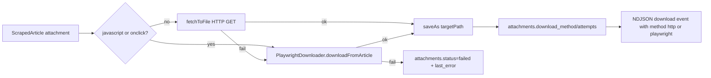

# IEPS UI 라운드 2C — cli-collect Playwright Fallback + 다운로드 가시성

## 결정 사항 (사용자 확정)

- **트리거 정책**: 자동 폴백. HTTP fetch 우선 → 실패 또는 `javascript:`/onclick 패턴이면 Playwright 재시도. 기본 ON. `--no-playwright` 또는 `IEPS_PLAYWRIGHT=0` 으로 비활성화.
- **시각화 범위**: `attachments` 테이블에 `download_method` / `download_attempts` / `last_error` 컬럼 추가 → `/data/status` 에 통계 카드 노출.
- **비범위**: 로그인 필요 게시판, SSO/OTP, 다운로드 외 작업(렌더 캡처 / 스크린샷 / 본문 동적 렌더링)은 모두 라운드 외.

## 데이터 흐름

## 1. DB 스키마 (멱등 마이그레이션)

[scraper/lib/scraper/scraper-db.ts](../scraper/lib/scraper/scraper-db.ts) `initSchema()` + [frontend/lib/db.ts](../frontend/lib/db.ts) `ensureAuthSchema()` 양쪽에 ALTER 추가 (`PRAGMA table_info` 검사 후):

- `attachments.download_method TEXT` — `'http'` | `'playwright'` | `null`
- `attachments.download_attempts INTEGER DEFAULT 0`
- `attachments.last_error TEXT`

## 2. 신규 모듈 — Playwright 다운로더

신규 [scraper/lib/ieps/playwright-downloader.ts](../scraper/lib/ieps/playwright-downloader.ts):

- `PlaywrightDownloader.create({ headless, timeoutMs })`: chromium 1회 init.
- `downloadFromArticle({ articleUrl, fileName, targetPath, selectorHints? })`: 매 호출마다 새 브라우저 컨텍스트 → `page.goto(articleUrl)` → 첨부 매칭 휴리스틱 (파일명 텍스트, `onclick*='fileDown'|'download'|'atchFile'`, `href*='download'`) → 첫 매치 클릭 → `page.waitForEvent('download')` → `download.saveAs(targetPath)`.
- `close()`: 브라우저 정리.
- 휴리스틱 실패 시 `error: 'no-match'`, 타임아웃 시 `error: 'timeout'`, 클릭 후 다운로드 미발생 시 `error: 'no-download'` 로 명확히 반환.

## 3. cli-collect 통합

[scraper/scripts/cli-collect.ts](../scraper/scripts/cli-collect.ts) 수정:

### 3.1 CLI 옵션 추가

- `--no-playwright` — 폴백 비활성화
- `--playwright-headless=true|false` (기본 true)
- `--playwright-timeout=ms` (기본 60_000)
- `IEPS_PLAYWRIGHT=0` 환경변수도 동일하게 비활성.

### 3.2 `downloadPdfsToRaw()` 보강

각 첨부에 대해:

1. `downloadUrl.startsWith('javascript:')` 또는 onclick 식별자만 있으면 HTTP 스킵, Playwright 직행 (`attempts=1, method='playwright'`).
2. 아니면 `fetchToFile()` 호출 후 실패 시 Playwright 폴백 시도 (`attempts=2, method='playwright'`).
3. 결과를 SQLite 에 반영 (helper `markAttachment(fileId, …)`):
   - 성공 → `status='downloaded', local_path, downloaded_at, download_method, download_attempts+=N, last_error=NULL`.
   - 실패 → `status='failed', download_attempts+=1, last_error=<reason>`.
4. NDJSON emit 추가 필드: `method`, `attempts`, `status`, `reason?`.

### 3.3 라이프사이클

PlaywrightDownloader 는 lazy init: 첫 폴백 필요 시 1회 생성, `main()` finally 에서 `close()`. 호출 0회면 chromium 미기동 → 기존 워크플로 영향 없음.

## 4. Frontend 가시성

### 4.1 ProgressDrawer

[frontend/components/dashboard/ProgressDrawer.tsx](../frontend/components/dashboard/ProgressDrawer.tsx) — download 단계 라인에 method 배지 (`HTTP` / `PLAYWRIGHT`) 추가, `attempts > 1` 시 재시도 표기, `status='failed'` 시 빨간 배지 + reason 노출.

### 4.2 KpiPanel + getKpiSummary

- [frontend/lib/ieps/queries.ts](../frontend/lib/ieps/queries.ts) `getKpiSummary()` 가 다음을 추가 반환:
  - `playwrightFallbacks` — `attachments.download_method='playwright'` 카운트
  - `failedDownloads` — `attachments.status='failed'` 카운트
- [frontend/components/dashboard/KpiPanel.tsx](../frontend/components/dashboard/KpiPanel.tsx) — 기존 5장 → 6장 그리드. "Playwright 폴백" 카드 신설(폴백이 0건이어도 표시). "다운로드 실패" 는 hint 로 표기.

### 4.3 권한

KpiPanel 은 viewer 도 그대로 읽기 가능. 새 write API 없음 — `requireAuthenticated()` 만.

## 5. 검증 시나리오

1. `npm run build` (frontend) + `npx ts-node --transpile-only scraper/scripts/cli-collect.ts --help` 양쪽 통과.
2. 기존 정상 PDF 게시물 cli-collect 실행 → 모든 첨부 `download_method='http'` (Playwright 미기동, KpiPanel 폴백 0건).
3. `--no-playwright` 로 javascript: 패턴 첨부 시도 → `status='failed', last_error='javascript-only'`, KPI "다운로드 실패" +1.
4. 폴백 ON 으로 재실행 → Playwright 기동, `download_method='playwright', download_attempts >= 2`, "Playwright 폴백" 카운트 +1.
5. SSE `download` 이벤트의 `method`/`attempts` 필드가 ProgressDrawer 배지로 렌더.
6. `/data/status` KpiPanel 6장 — viewer 도 동일하게 보임.
7. README §9 "Playwright Fallback (라운드 2C)" 섹션 추가 — 트리거 정책 / 환경변수 / KPI 의미 / 비범위 명시.

## 6. 파일 변경 요약

- 신규: [scraper/lib/ieps/playwright-downloader.ts](../scraper/lib/ieps/playwright-downloader.ts), [docs/ieps-ui-round-2c.md](./ieps-ui-round-2c.md)
- 수정: [scraper/lib/scraper/scraper-db.ts](../scraper/lib/scraper/scraper-db.ts), [scraper/scripts/cli-collect.ts](../scraper/scripts/cli-collect.ts), [frontend/lib/db.ts](../frontend/lib/db.ts), [frontend/lib/ieps/queries.ts](../frontend/lib/ieps/queries.ts), [frontend/components/dashboard/KpiPanel.tsx](../frontend/components/dashboard/KpiPanel.tsx), [frontend/components/dashboard/ProgressDrawer.tsx](../frontend/components/dashboard/ProgressDrawer.tsx), [README.md](../README.md)
- DB: `attachments` 컬럼 3종 ALTER (멱등). 기존 데이터 그대로 유지.
