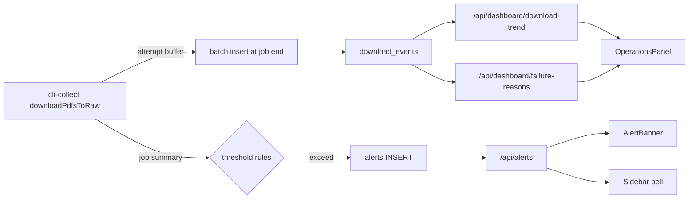

# IEPS UI 라운드 3 — 운영 관측 보강 (Observe-only + In-app Alerts)

## 결정 사항 (사용자 확정)

- **정책 스코프**: 관측만 (`observe-only`). cli-collect 의 시도/재시도/HTTP→Playwright 폴백 흐름은 라운드 2C 그대로 유지. 자동 스킵·백오프 없음.
- **알람 채널**: 인앱 + 구조화 로그 (`in-app-plus-log`). 외부 웹훅·이메일은 라운드 외.
- **시간 윈도우**: 기본 7일, UI 토글로 24h / 7d / 30d. 임계값은 기본값 하드코드(편집 UI 는 후속 라운드).

## 데이터 흐름



## 1. DB 스키마 (멱등 + 신규 2 테이블)

[scraper/lib/scraper/scraper-db.ts](../scraper/lib/scraper/scraper-db.ts) `initSchema()` + [frontend/lib/db.ts](../frontend/lib/db.ts) `ensureAuthSchema()` 양쪽에 `CREATE TABLE IF NOT EXISTS` 추가.

### 1.1 `download_events` — 시도 단위 시계열

```sql
CREATE TABLE IF NOT EXISTS download_events (
  id INTEGER PRIMARY KEY AUTOINCREMENT,
  file_id TEXT,
  download_url TEXT,
  method TEXT NOT NULL,            -- 'http' | 'playwright' | 'cache' | 'skipped'
  status TEXT NOT NULL,            -- 'ok' | 'failed'
  attempt_no INTEGER NOT NULL,
  bytes INTEGER,
  error TEXT,
  job_id TEXT,                     -- scrape_logs.log_id 와 매칭
  occurred_at TEXT NOT NULL
);
CREATE INDEX IF NOT EXISTS idx_download_events_time ON download_events(occurred_at);
CREATE INDEX IF NOT EXISTS idx_download_events_method_status ON download_events(method, status);
CREATE INDEX IF NOT EXISTS idx_download_events_job ON download_events(job_id);
```

### 1.2 `alerts` — 인앱 알람

```sql
CREATE TABLE IF NOT EXISTS alerts (
  id INTEGER PRIMARY KEY AUTOINCREMENT,
  severity TEXT NOT NULL,          -- 'info' | 'warn' | 'error'
  source TEXT NOT NULL,            -- 'download' | 'scrape' | 'parse'
  code TEXT NOT NULL,              -- 'high-failure-rate' | 'playwright-spike' | 'persistent-failure'
  title TEXT NOT NULL,
  body TEXT,
  payload_json TEXT,               -- 집계 메트릭 스냅샷
  job_id TEXT,
  created_at TEXT NOT NULL,
  acknowledged_at TEXT,
  acknowledged_by TEXT
);
CREATE INDEX IF NOT EXISTS idx_alerts_created ON alerts(created_at);
CREATE INDEX IF NOT EXISTS idx_alerts_open ON alerts(acknowledged_at);
CREATE INDEX IF NOT EXISTS idx_alerts_severity ON alerts(severity);
```

## 2. cli-collect 변경 (관측만)

[scraper/scripts/cli-collect.ts](../scraper/scripts/cli-collect.ts) 의 `downloadPdfsToRaw()` 시그니처는 유지. 내부에 시도 결과 버퍼만 추가.

- `emitDownload()` 가 호출될 때마다 in-memory `attemptBuffer` 에 push.
- `main()` 의 finally 직전에 `flushDownloadEvents(jobId, attemptBuffer)` 로 일괄 INSERT.
- 잡 종료 후 `evaluateAlertRules({ stats, jobId, db })` 호출 → 임계 초과 시 `alerts` INSERT.
- HTTP/Playwright/캐시 분류와 attempts/last_error 는 라운드 2C 결과를 그대로 사용 — 추가 시도/스킵 로직 없음.

### 2.1 임계값 기본 룰 (하드코드)

| code | severity | 조건 |
| --- | --- | --- |
| `high-failure-rate` | `warn` | `failed >= 5` AND `failed / totalAttachments >= 0.3` |
| `playwright-spike` | `info` | `playwrightSucceeded >= 5` AND `playwrightSucceeded / max(totalAttachments,1) >= 0.5` |
| `persistent-failure` | `error` | 동일 `download_url` 이 최근 7일 `download_events` 에서 `status='failed'` 3회 이상 |

룰은 [scraper/lib/ieps/alert-rules.ts](../scraper/lib/ieps/alert-rules.ts) 신규 모듈로 분리.

## 3. 신규 API (Node 런타임, `requireAuthenticated()`)

- `GET /api/alerts?status=open|all&limit=50` — 알람 목록 (viewer+)
- `GET /api/alerts/unread-count` — 미확인 카운트 (viewer+)
- `POST /api/alerts/:id/ack` — 확인 처리 (editor+, audit_log 기록)
- `GET /api/dashboard/download-trend?days=7|30` — 일 단위 method×status 집계
- `GET /api/dashboard/failure-reasons?days=7` — `download_events.error` Top 10 + 빈도

쿼리는 모두 [frontend/lib/ieps/queries.ts](../frontend/lib/ieps/queries.ts) 에 helper 추가하고 `invalidateDb()` 로 cli-collect 갱신 즉시 반영.

## 4. 프론트엔드

### 4.1 신규 컴포넌트

- [frontend/components/dashboard/AlertBanner.tsx](../frontend/components/dashboard/AlertBanner.tsx) — 미확인 알람 ≥ 1 일 때 `/data/status` 상단에 표시. 가장 심각한 severity 색상 사용.
- [frontend/components/dashboard/AlertDrawer.tsx](../frontend/components/dashboard/AlertDrawer.tsx) — 사이드바 봉지 아이콘 클릭 시 우측 드로어. 알람 카드 + ack 버튼 (editor+).
- [frontend/components/dashboard/OperationsPanel.tsx](../frontend/components/dashboard/OperationsPanel.tsx) — `RegionMap` 아래 / `CollectionOptionsCard` 위에 배치. 24h/7d/30d 토글 + 일 단위 stacked bar (HTTP/Playwright/실패) + 실패 사유 도넛.

### 4.2 기존 변경

- [frontend/components/AppSidebar.tsx](../frontend/components/AppSidebar.tsx) (또는 동등 헤더 컴포넌트) 에 봉지 아이콘 + 미확인 카운트 배지.
- [frontend/app/(app)/data/status/page.tsx](../frontend/app/%28app%29/data/status/page.tsx) 에 `AlertBanner`, `OperationsPanel` 추가. 라운드 2B/2C 컴포넌트 순서 유지.

### 4.3 시각화 라이브러리

`d3-shape` (이미 설치됨, 라운드 2B) 만 활용. 별도 chart 라이브러리 추가 없음. stacked bar 와 도넛은 SVG 직접 렌더.

## 5. 권한

| 동작 | viewer | editor | admin |
| --- | --- | --- | --- |
| 알람 조회 | O | O | O |
| 알람 ack | X | O | O |
| OperationsPanel 조회 | O | O | O |
| 임계값 편집 | (라운드 외) | (라운드 외) | (라운드 외) |

ack 액션은 `audit_log(target_table='alerts', action='alert.ack')` 에 기록.

## 6. 검증 시나리오

1. `cd frontend && npm run build` 통과 + `cd scraper && npx ts-node --transpile-only scripts/cli-collect.ts --help` 통과.
2. 빈 DB 에 cli-collect 1회 실행 → `download_events` 에 첨부 수만큼 row 생성, `alerts` 비어 있음.
3. 다운로드 5건 중 2건 의도적 실패(테스트용 잘못된 URL) → 잡 종료 후 `alerts.code='high-failure-rate'` 1건 INSERT, `severity='warn'`.
4. `/data/status` 진입 시 `AlertBanner` 가 미확인 1건 표시 → 봉지 아이콘에서도 카운트 1, 클릭 시 `AlertDrawer` 에 카드형 알람.
5. editor 계정으로 ack 클릭 → `acknowledged_at` 채워짐, 배너 사라짐, audit_log 1건 추가. viewer 계정에서는 ack 버튼 disabled.
6. `OperationsPanel` 토글 24h/7d/30d 시 stacked bar 와 도넛이 갱신. 실패 사유 도넛이 `error` 필드 Top 10 (예: `javascript-only`, `no-match`, `http-failed`) 표시.
7. 동일 잘못된 URL 의 게시물을 7일 내 3회 재실행 → `persistent-failure` 알람 1건 (`severity='error'`) 추가 생성.

## 7. 파일 변경 요약

- 신규: [scraper/lib/ieps/alert-rules.ts](../scraper/lib/ieps/alert-rules.ts), [frontend/components/dashboard/AlertBanner.tsx](../frontend/components/dashboard/AlertBanner.tsx), [frontend/components/dashboard/AlertDrawer.tsx](../frontend/components/dashboard/AlertDrawer.tsx), [frontend/components/dashboard/OperationsPanel.tsx](../frontend/components/dashboard/OperationsPanel.tsx), [frontend/app/api/alerts/route.ts](../frontend/app/api/alerts/route.ts), `frontend/app/api/alerts/[id]/ack/route.ts`, [frontend/app/api/alerts/unread-count/route.ts](../frontend/app/api/alerts/unread-count/route.ts), [frontend/app/api/dashboard/download-trend/route.ts](../frontend/app/api/dashboard/download-trend/route.ts), [frontend/app/api/dashboard/failure-reasons/route.ts](../frontend/app/api/dashboard/failure-reasons/route.ts), [docs/ieps-ui-round-3.md](./ieps-ui-round-3.md).
- 수정: [scraper/lib/scraper/scraper-db.ts](../scraper/lib/scraper/scraper-db.ts), [frontend/lib/db.ts](../frontend/lib/db.ts), [frontend/lib/ieps/queries.ts](../frontend/lib/ieps/queries.ts), [scraper/scripts/cli-collect.ts](../scraper/scripts/cli-collect.ts), [frontend/app/(app)/data/status/page.tsx](../frontend/app/%28app%29/data/status/page.tsx), [frontend/components/AppSidebar.tsx](../frontend/components/AppSidebar.tsx) (또는 동등 헤더 컴포넌트), [README.md](../README.md).
- DB: `download_events`, `alerts` 신규 테이블 + 인덱스. 기존 데이터 무영향.

## 8. 명시적 비범위

- 외부 알람 채널 (Slack/이메일/Webhook) — 후속 라운드 후보.
- 자동 재시도/백오프/쿨다운 — 라운드 외 (사용자 결정).
- 임계값 편집 UI — 후속 "설정 페이지" 단계.
- HAPs/ESG 등 외부 데이터 소스 통합 — 별도 라운드.
