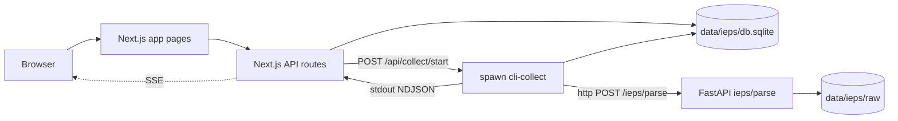

# IEPS UI 라운드 1 — Next.js 프론트엔드 + 백엔드 연동

라운드 0(백엔드/스크래퍼/OCR 코어)이 끝난 시점에서 prototype HTML
([prototype/ieps-dashboard.html](../prototype/ieps-dashboard.html))을 실제
Next.js 앱으로 옮기고, FastAPI 백엔드 / cli-collect 스크래퍼 / SQLite
(`data/ieps/db.sqlite`)와 연결하는 라운드입니다.

## 0. 결정 사항 (사용자 확정)

- **범위 B**: 데이터 > 수집 현황 + 데이터 > 검수 대기열 + 데이터 > 설정
  (CollectionConfig 목록). 사이드바 4메뉴 중 사업장/계약/영업·마케팅은
  placeholder 페이지.
- **트리거 A**: Next.js API route → `child_process.spawn`으로 cli-collect
  실행, stdout NDJSON을 SSE로 클라이언트에 스트리밍.

## 1. 작업 범위 / 비범위

### 범위
- `MCM/frontend/` 신규 Next.js 14 (App Router) 앱 생성.
- prototype HTML 디자인을 React 컴포넌트로 이식 (CollectionConfig 편집 상태
  머신 포함).
- 사이드바 4메뉴 + 데이터 하위 3페이지 (수집 현황 / 검수 대기열 / 설정).
- 사업장/계약/영업·마케팅: placeholder 페이지 (빈 상태 안내).
- SQLite (`data/ieps/db.sqlite`) 공유 read/write — sql.js 사용.
- 수집 트리거 + SSE 진행률 스트리밍 + cli-collect의 NDJSON 출력 보강.
- backend FastAPI는 그대로 유지 (변경 없음).

### 비범위
- 인증/사용자 관리 (로컬 데모 모드).
- 사업장 마스터 CRUD UI (B 범위 외).
- onclick/세션 다운로드 분기 (이번 라운드는 정적 HTTP만으로 동작 확인됨).
- backend OCR 엔진 추가/조정.

## 2. 프로젝트 구조

```
MCM/
├── frontend/                                # 신규 Next.js 앱
│   ├── app/
│   │   ├── layout.tsx                       # 전역 레이아웃 (Sidebar + TopBar + reveal)
│   │   ├── globals.css                      # prototype CSS 토큰 이전
│   │   ├── page.tsx                         # /data/status로 redirect
│   │   ├── (app)/
│   │   │   ├── data/
│   │   │   │   ├── status/page.tsx          # 메인 대시보드
│   │   │   │   ├── review/page.tsx          # 검수 대기열
│   │   │   │   └── settings/page.tsx        # CollectionConfig 목록
│   │   │   ├── facilities/page.tsx          # placeholder
│   │   │   ├── contracts/page.tsx           # placeholder
│   │   │   └── sales/page.tsx               # placeholder
│   │   └── api/
│   │       ├── health/route.ts
│   │       ├── collection-configs/route.ts
│   │       ├── collection-configs/[id]/route.ts
│   │       ├── collect/start/route.ts       # SSE 스트림
│   │       ├── dashboard/kpi/route.ts
│   │       ├── dashboard/recent-facilities/route.ts
│   │       ├── parsed-fields/route.ts
│   │       └── parsed-fields/[id]/route.ts
│   ├── components/
│   │   ├── layout/{Sidebar, TopBar}.tsx
│   │   ├── dashboard/{KPICard, RecentResultsTable, CollectionOptionsCard}.tsx
│   │   ├── dashboard/{RuleEditModal, ProgressDrawer}.tsx
│   │   ├── review/{ReviewQueueTable, ReviewSidePanel}.tsx
│   │   └── ui/{Chip, Toggle, Field, Button, Toast}.tsx
│   ├── lib/
│   │   ├── db.ts                            # sql.js 래퍼 (scraper와 동일 db.sqlite)
│   │   ├── ieps/types.ts                    # CollectionConfig/ExtractionRule 타입
│   │   ├── ieps/defaults.ts                 # 9개 빌트인 룰 (cli-collect와 동일 소스 import)
│   │   └── ieps/job-runner.ts               # spawn cli-collect + NDJSON 파서
│   ├── package.json
│   ├── tsconfig.json
│   ├── tailwind.config.ts
│   └── next.config.mjs
└── scraper/
    ├── lib/ieps/builtin-rules.ts            # cli-collect의 DEFAULT_RULES를 분리 (frontend와 공용)
    └── scripts/cli-collect.ts               # `--json-progress` 플래그 추가
```

## 3. 데이터 흐름



## 4. 디자인 시스템

prototype HTML이 이미 사용자 룰을 따르고 있으므로 그대로 React로 이식.

- `frontend/app/globals.css`에 prototype `<style>` 블록을 그대로 이전
  (`--background: #F2F4F7`, `--primary: #16A34A`, `.glass-panel`,
  `.glass-card`, `.ui-chip`, `.reveal`, `.dot-bg`, `.modal-overlay` 등).
- `tailwind.config.ts`는 Web Scraper Final과 동일 패턴 (CSS 변수 매핑만).
- 폰트: prototype의 `-apple-system, "Segoe UI"...` 시스템 폰트 페어링 유지.
  `brand-mark` 클래스 letter-spacing -0.02em.
- 사용자 룰 준수 체크:
  - 보라 그라데이션 / Inter 미사용 (시스템 폰트 + 녹색 #16A34A 포인트).
  - 미적 방향: 미니멀 글라스모피즘 + dot-bg 배경 텍스처 (prototype과 일관).
  - CSS 변수 통일, 비대칭 레이아웃 (KPI 5분할 + 우측 결과 + 하단 옵션).
  - staggered reveal 애니, 글라스모피즘 절제(panel/card/modal만).

## 5. 페이지별 상세

### 5.1 `/data/status` — 수집 현황 (메인 대시보드)

prototype의 main 영역을 그대로 React로 이식. 카드 4개:

1. **IEPS 수집 파이프라인 카드** (`KPICard` × 5)
   - "누적 수집 사업장" — `SELECT count(*) FROM facilities`.
   - "최근 24h 신규" — `facilities.created_at >= ?`.
   - "다운로드 완료 PDF" — `attachments.status='downloaded' AND file_type='pdf'`.
   - "파싱 완료" — `SELECT count(distinct attachment_id) FROM parsed_fields`.
   - "검수 대기" — `parsed_fields.needs_review=1`.
2. **수집 결과 카드** (`RecentResultsTable`)
   - facilities ⨝ permits 최신 10건. 컬럼: 상호 / 결정번호 / 업종 / 허가일자 / created_at.
3. **수집 옵션 카드** (`CollectionOptionsCard`)
   - prototype의 chip / toggle / extraction-range / rules 모두 React state
     (useReducer)로 이식.
   - "수집 시작" 버튼 → `POST /api/collect/start` → `ProgressDrawer` 슬라이드인.
4. **수집 상태 패널** (`ProgressDrawer`)
   - SSE EventSource로 단계별 진행률 + 로그 라이브 표시
     (scraping / downloading / parsing / upserting / done).
   - 종료 시 KPI / 결과 테이블 자동 refetch (SWR mutate).

### 5.2 `/data/review` — 검수 대기열

- `parsed_fields.needs_review=1`인 행 + facilities/permits/attachments join.
- 좌측 테이블: 사업장 / 항목(label) / 원본값 / 정규화값 / 신뢰도 /
  sourceText 미리보기.
- 행 클릭 시 우측 사이드패널(`ReviewSidePanel`)에 sourceText 전체 +
  reviewed_value 입력 폼.
- "확정" 버튼 → `PATCH /api/parsed-fields/[id]` (reviewed_value 저장 +
  needs_review=0).

### 5.3 `/data/settings` — CollectionConfig 목록

- `collection_configs` 테이블 목록 (이름 / 마지막 수정일 / 기본 여부).
- "새 설정" → `RuleEditModal` 재사용한 빈 CollectionConfig 작성 폼
  (수집 옵션 카드와 동일).
- 행 편집 / 기본값 토글 / 삭제.

### 5.4 placeholder 페이지

- `/facilities`, `/contracts`, `/sales` 각각 동일한 글라스 카드에
  "다음 라운드에서 구현 예정" 안내. 사이드바/탑바는 4메뉴 모두 활성화.

## 6. API 라우트 명세

| Method | Path | 설명 |
| --- | --- | --- |
| GET | `/api/health` | DB / cli-collect 경로 헬스체크 |
| GET | `/api/collection-configs` | 저장된 CollectionConfig 목록 |
| POST | `/api/collection-configs` | 신규 저장 |
| PATCH | `/api/collection-configs/[id]` | 갱신 / 기본값 토글 |
| DELETE | `/api/collection-configs/[id]` | 삭제 |
| POST | `/api/collect/start` | cli-collect spawn + SSE 스트림 응답 |
| GET | `/api/dashboard/kpi` | 5개 KPI 집계 |
| GET | `/api/dashboard/recent-facilities` | 최근 사업장 10건 |
| GET | `/api/parsed-fields?needs_review=1` | 검수 대기열 |
| PATCH | `/api/parsed-fields/[id]` | reviewed_value 저장 |

## 7. 수집 트리거 + SSE 흐름

### 7.1 cli-collect 보강

`[scraper/scripts/cli-collect.ts](../scraper/scripts/cli-collect.ts)`에
`--json-progress` 플래그 추가. 활성화 시 단계별로 NDJSON 출력:

```
{"event":"scrape","phase":"start","total":1,"current":0}
{"event":"scrape","phase":"page","page":1,"articles":10}
{"event":"download","fileName":"...","bytes":1285698}
{"event":"parse","postId":"3520","status":"ok"}
{"event":"upsert","facility":"미래석유","permitId":"pmt_..."}
{"event":"done","summaryPath":"..."}
```

기존 `console.log`는 유지하되, `--json-progress` 모드에서는 NDJSON만
stdout, 사람용 로그는 stderr로 분리.

### 7.2 Next.js spawn 어댑터 — `frontend/lib/ieps/job-runner.ts`

```text
spawn("npx", ["ts-node", "scripts/cli-collect.ts", "--json-progress", ...])
  cwd: MCM/scraper
stdout → readline → SSE write
client disconnect → child kill
```

### 7.3 클라이언트 — `ProgressDrawer`

- `new EventSource("/api/collect/start?configId=...")`로 구독.
- 단계별 progress bar (scrape / download / parse / upsert) + 로그 스트림.
- `done` 이벤트 수신 시 KPI / RecentResultsTable refetch (SWR mutate).

## 8. SQLite 접근 (Next.js)

- 라이브러리: **sql.js** (scraper와 동일, native binding 회피).
- `frontend/lib/db.ts`: `loadDb()` (READ는 동일 인스턴스 캐시),
  `saveDb()` (write 후 디스크 flush).
- 환경변수 `IEPS_DB_PATH`로 절대 경로 지정. 기본값
  `path.resolve(process.cwd(), "../data/ieps/db.sqlite")`.
- 동시쓰기 충돌 방지: collect job이 도는 동안 Next.js 측 write API는
  in-memory mutex로 보호.

## 9. 핵심 구현 세부

- **CollectionConfig 타입 일치**: `frontend/lib/ieps/types.ts`는
  [backend/app/ieps/models.py](../backend/app/ieps/models.py)의 Pydantic
  alias(`startPage`/`endPage`/`activeRuleIds` 등 camelCase)와 1:1 매칭.
- **9개 빌트인 룰 단일 소스화**: 현재 cli-collect / backend / 프론트가
  각자 빌트인 정의 보유. 이번 라운드에서 cli-collect의 `DEFAULT_RULES`를
  `scraper/lib/ieps/builtin-rules.ts`로 분리하고 frontend가 path alias로
  `@scraper/lib/ieps/builtin-rules` 형태로 import.
- **검수 확정 시**: `parsed_fields.reviewed_value` + `needs_review=0`만
  갱신. facilities/permits 마스터 갱신은 다음 라운드.
- **빈 상태/오류 상태**: 모든 페이지에 `EmptyState` 컴포넌트 (글라스 카드 + 안내 문구).

## 10. 사용자 룰 준수 체크리스트

- 보라 그라데이션 / Inter 절대 미사용 (시스템 폰트 + 녹색 #16A34A 포인트).
- 미적 방향: 미니멀 글라스모피즘 + dot-bg 배경 텍스처. prototype과 일관.
- CSS 변수: `--background / --foreground / --primary` 외 추가 시
  `globals.css`에서만 정의.
- 비대칭 레이아웃: 좌측 KPI(2열 grid) + 우측 수집 결과 + 하단 수집 옵션.
- staggered reveal: `.reveal .delay-1~5` 그대로 사용.
- 글라스모피즘 절제: 모달/패널/카드만 적용, 본문/입력 필드는 불투명 배경.

## 11. 검증 시나리오

1. `cd frontend && npm install && npm run dev` → `http://localhost:3000`
   접근, 사이드바 4메뉴 + 데이터 하위 3페이지 라우팅 OK.
2. `/data/status` 진입 시 KPI 5개가 SQLite에서 즉시 fetch (라운드 0에서
   수집된 데이터 활용).
3. "수집 시작" 클릭 → ProgressDrawer 진행률 라이브 업데이트 → 종료 후
   KPI / 결과 테이블 자동 갱신.
4. `/data/review`에서 needs_review 행 표시, 행 클릭 → 사이드패널 →
   reviewed_value 저장 → 목록에서 사라짐.
5. `/data/settings`에서 새 CollectionConfig 저장 → 다시 `/data/status`
   수집 옵션 카드의 "설정 불러오기" 드롭다운에 표시.
6. backend(8001) 미가동 시 ProgressDrawer가 명확한 에러 메시지 표시 +
   KPI는 정상 (DB read만 사용).

## 12. 다음 라운드 연결 포인트

- 사업장 마스터 페이지(`/facilities`)에서
  `facilities ⨝ permits ⨝ permit_scales ⨝ product_outputs` 상세 패널.
- 계약 / 영업·마케팅 메뉴 데이터 모델 추가 (별도 plan).
- 인증 도입 시 `(auth)` route group 추가.
- onclick/세션 다운로드 대응을 위한 cli-collect Playwright 분기.

## 13. 작업 To-do (구현 시 체크리스트)

1. `frontend` Next.js 앱 스캐폴딩 + Tailwind/CSS 변수 설정.
2. 공통 레이아웃 (Sidebar / TopBar / reveal 애니) 구현.
3. `lib/db.ts` (sql.js 래퍼) + `lib/ieps/types.ts` + 빌트인 룰 단일 소스화.
4. `/data/status` KPI / RecentResultsTable / CollectionOptionsCard / RuleEditModal.
5. `cli-collect.ts`에 `--json-progress` 플래그 추가, 단계별 NDJSON 출력.
6. `/api/collect/start` SSE + `ProgressDrawer` 클라이언트.
7. `/data/review` + `/api/parsed-fields` GET/PATCH.
8. `/data/settings` + `/api/collection-configs` CRUD.
9. placeholder 페이지 (사업장/계약/영업·마케팅) + `EmptyState`.
10. 검증 시나리오 1~6 수동 실행 후 README에 frontend 섹션 추가.
